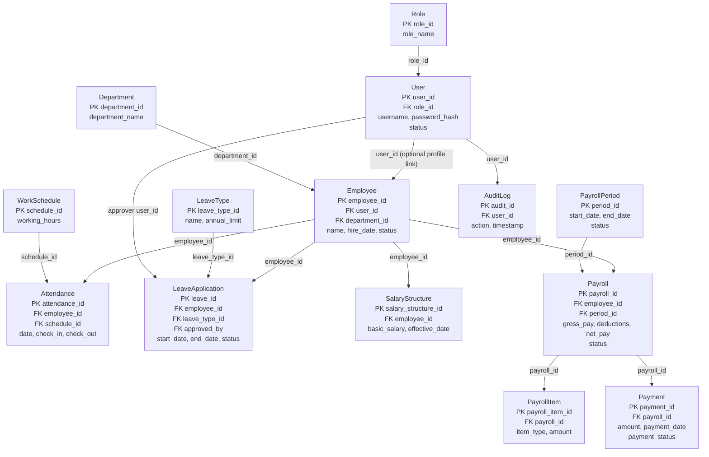

```mermaid

flowchart TB
    Role["Role<br/>PK role_id<br/>role_name"]
    User["User<br/>PK user_id<br/>FK role_id<br/>username, password_hash<br/>status"]
    Department["Department<br/>PK department_id<br/>department_name"]
    Employee["Employee<br/>PK employee_id<br/>FK user_id<br/>FK department_id<br/>name, hire_date, status"]
    WorkSchedule["WorkSchedule<br/>PK schedule_id<br/>working_hours"]
    Attendance["Attendance<br/>PK attendance_id<br/>FK employee_id<br/>FK schedule_id<br/>date, check_in, check_out"]
    LeaveType["LeaveType<br/>PK leave_type_id<br/>name, annual_limit"]
    LeaveApplication["LeaveApplication<br/>PK leave_id<br/>FK employee_id<br/>FK leave_type_id<br/>FK approved_by<br/>start_date, end_date, status"]
    SalaryStructure["SalaryStructure<br/>PK salary_structure_id<br/>FK employee_id<br/>basic_salary, effective_date"]
    PayrollPeriod["PayrollPeriod<br/>PK period_id<br/>start_date, end_date<br/>status"]
    Payroll["Payroll<br/>PK payroll_id<br/>FK employee_id<br/>FK period_id<br/>gross_pay, deductions, net_pay<br/>status"]
    PayrollItem["PayrollItem<br/>PK payroll_item_id<br/>FK payroll_id<br/>item_type, amount"]
    Payment["Payment<br/>PK payment_id<br/>FK payroll_id<br/>amount, payment_date<br/>payment_status"]
    AuditLog["AuditLog<br/>PK audit_id<br/>FK user_id<br/>action, timestamp"]

    Role -->|"role_id"| User
    User -->|"user_id (optional profile link)"| Employee
    Department -->|"department_id"| Employee
    Employee -->|"employee_id"| Attendance
    WorkSchedule -->|"schedule_id"| Attendance
    Employee -->|"employee_id"| LeaveApplication
    LeaveType -->|"leave_type_id"| LeaveApplication
    User -->|"approver user_id"| LeaveApplication
    Employee -->|"employee_id"| SalaryStructure
    Employee -->|"employee_id"| Payroll
    PayrollPeriod -->|"period_id"| Payroll
    Payroll -->|"payroll_id"| PayrollItem
    Payroll -->|"payroll_id"| Payment
    User -->|"user_id"| AuditLog
```