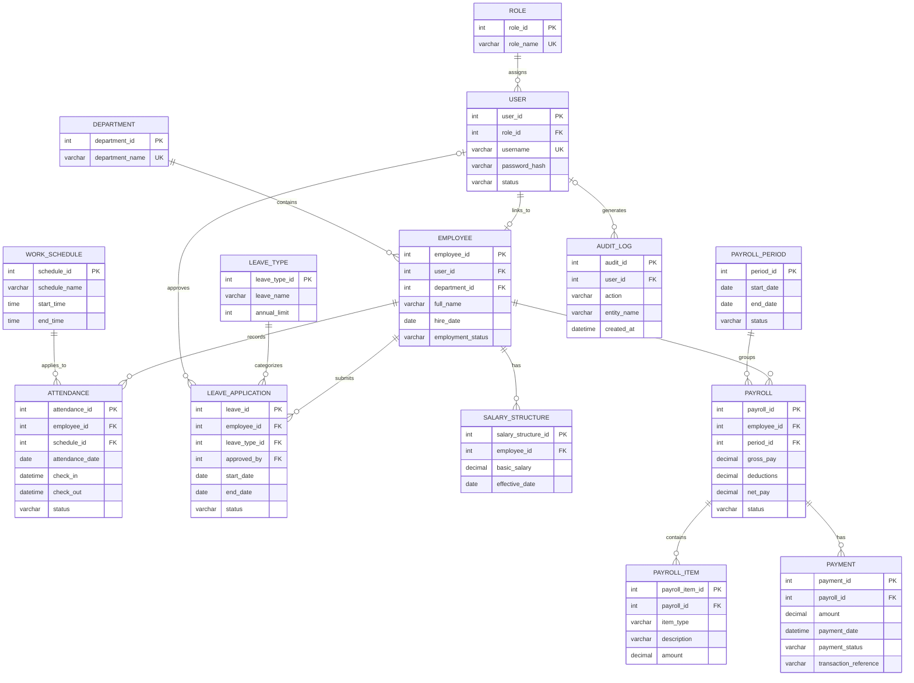

```mermaid
erDiagram
    ROLE {
        int role_id PK
        varchar role_name UK
    }

    USER {
        int user_id PK
        int role_id FK
        varchar username UK
        varchar password_hash
        varchar status
    }

    DEPARTMENT {
        int department_id PK
        varchar department_name UK
    }

    EMPLOYEE {
        int employee_id PK
        int user_id FK
        int department_id FK
        varchar full_name
        date hire_date
        varchar employment_status
    }

    WORK_SCHEDULE {
        int schedule_id PK
        varchar schedule_name
        time start_time
        time end_time
    }

    ATTENDANCE {
        int attendance_id PK
        int employee_id FK
        int schedule_id FK
        date attendance_date
        datetime check_in
        datetime check_out
        varchar status
    }

    LEAVE_TYPE {
        int leave_type_id PK
        varchar leave_name
        int annual_limit
    }

    LEAVE_APPLICATION {
        int leave_id PK
        int employee_id FK
        int leave_type_id FK
        int approved_by FK
        date start_date
        date end_date
        varchar status
    }

    SALARY_STRUCTURE {
        int salary_structure_id PK
        int employee_id FK
        decimal basic_salary
        date effective_date
    }

    PAYROLL_PERIOD {
        int period_id PK
        date start_date
        date end_date
        varchar status
    }

    PAYROLL {
        int payroll_id PK
        int employee_id FK
        int period_id FK
        decimal gross_pay
        decimal deductions
        decimal net_pay
        varchar status
    }

    PAYROLL_ITEM {
        int payroll_item_id PK
        int payroll_id FK
        varchar item_type
        varchar description
        decimal amount
    }

    PAYMENT {
        int payment_id PK
        int payroll_id FK
        decimal amount
        datetime payment_date
        varchar payment_status
        varchar transaction_reference
    }

    AUDIT_LOG {
        int audit_id PK
        int user_id FK
        varchar action
        varchar entity_name
        datetime created_at
    }

    ROLE ||--o{ USER : assigns
    USER ||--o| EMPLOYEE : links_to
    DEPARTMENT ||--o{ EMPLOYEE : contains
    EMPLOYEE ||--o{ ATTENDANCE : records
    WORK_SCHEDULE ||--o{ ATTENDANCE : applies_to
    EMPLOYEE ||--o{ LEAVE_APPLICATION : submits
    LEAVE_TYPE ||--o{ LEAVE_APPLICATION : categorizes
    USER o|--o{ LEAVE_APPLICATION : approves
    EMPLOYEE ||--o{ SALARY_STRUCTURE : has
    EMPLOYEE ||--o{ PAYROLL : receives
    PAYROLL_PERIOD ||--o{ PAYROLL : groups
    PAYROLL ||--o{ PAYROLL_ITEM : contains
    PAYROLL ||--o{ PAYMENT : has
    USER o|--o{ AUDIT_LOG : generates
```